## 📋 Outline

2019 Database Term Project  

도서 대출, 예약 및 관리 서비스

## ✔️ Development Environment Details

```
xampp for windows 7.1.30, xampp control panel 3.2.4
Apache 2.4.39
MariaDB 10.3.16 (MySQL)
phpMyAdmin 4.9.0.1
Bootstrap 4.3.1, popper.js, mdb.js, chart.js
JQuery 3.2.1
Ruby Sass 3.7.4
```

## 회원 페이지 Screen Shots

- 회원정보 수정
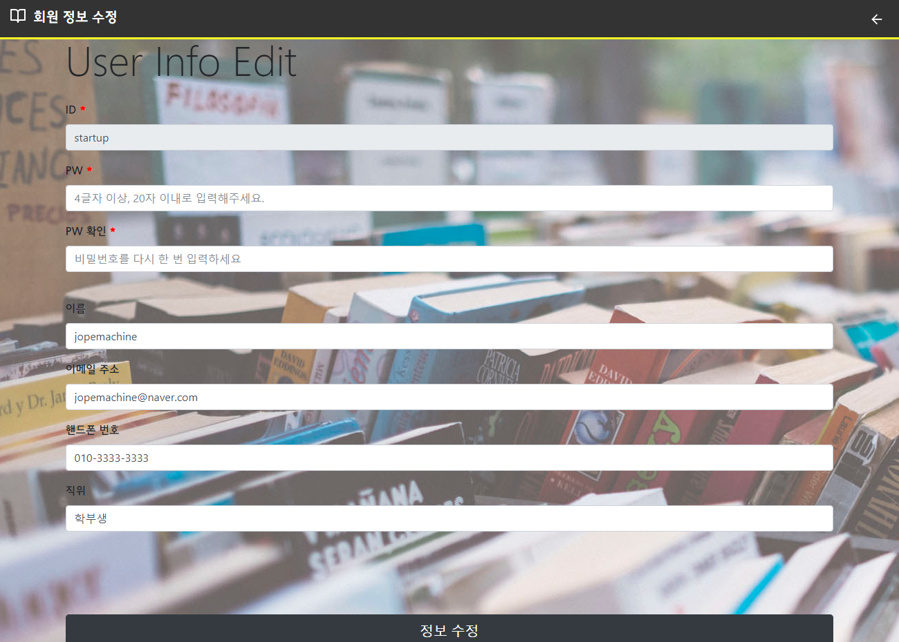
<br>

- 예약하기
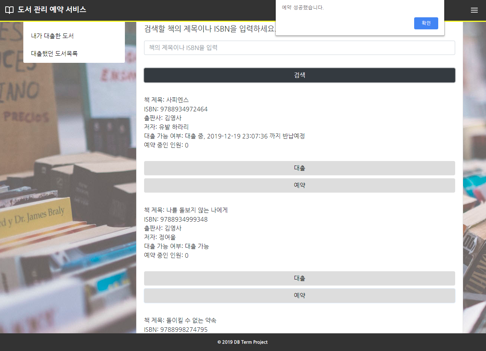
<br>

- 예약 확인
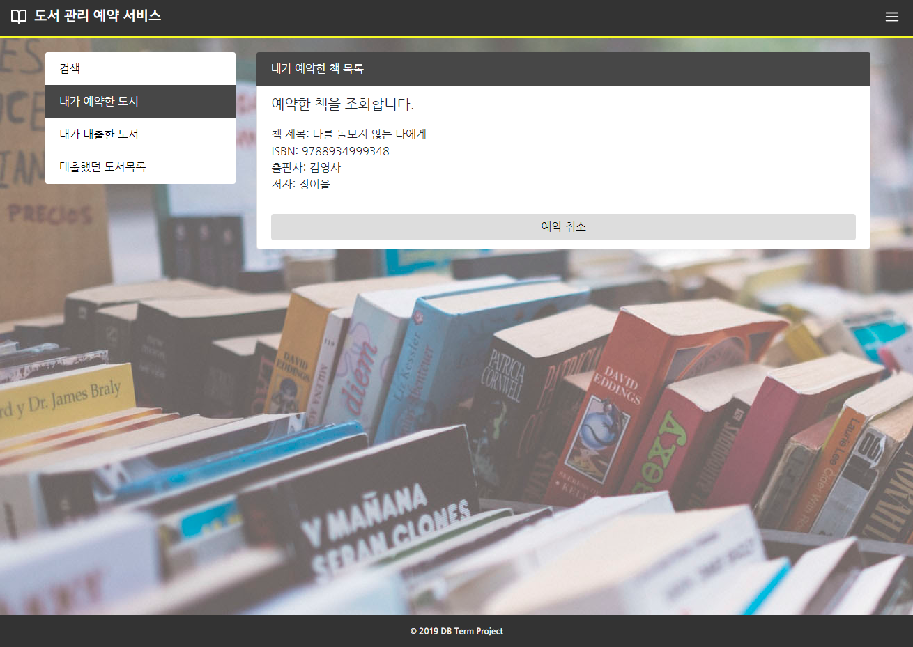
<br>

- 대출한 책 확인
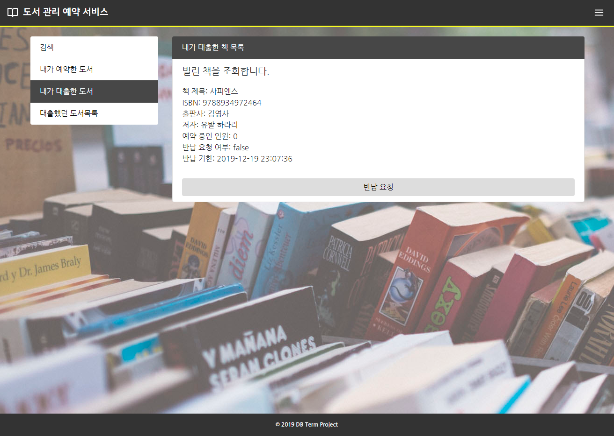
<br>

- 기간 별 대출 목록 확인
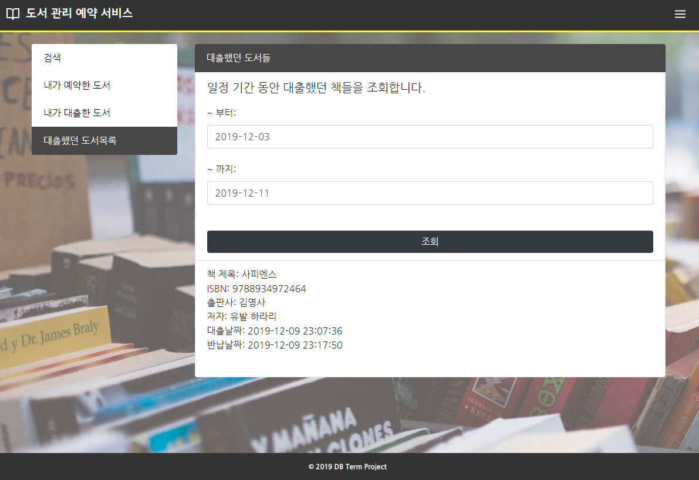
<br>

## 관리자 페이지 Screen Shots

- 도서 등록
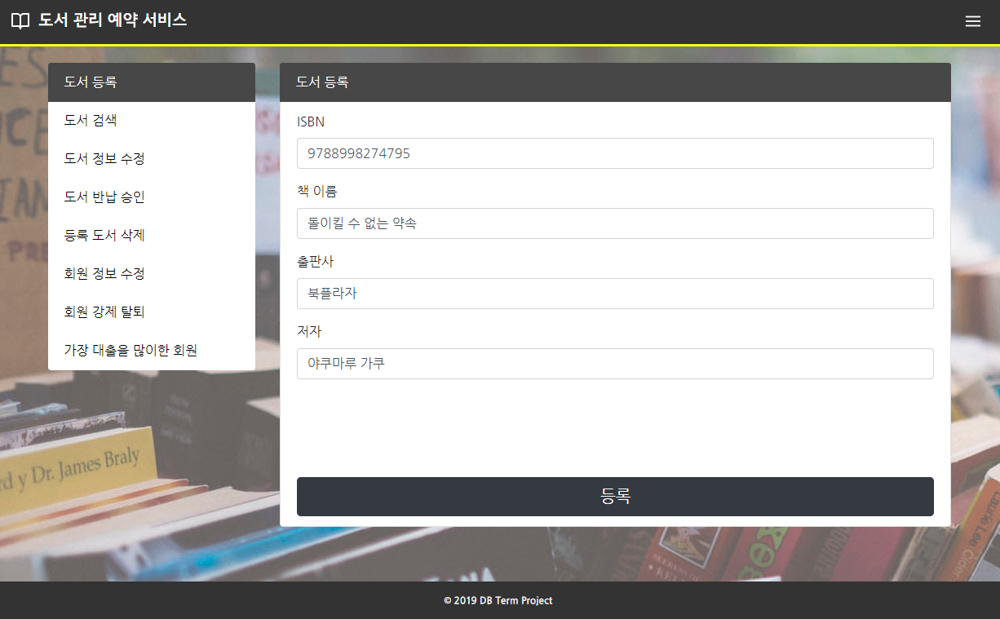
<br>

- ISBN으로 도서 검색
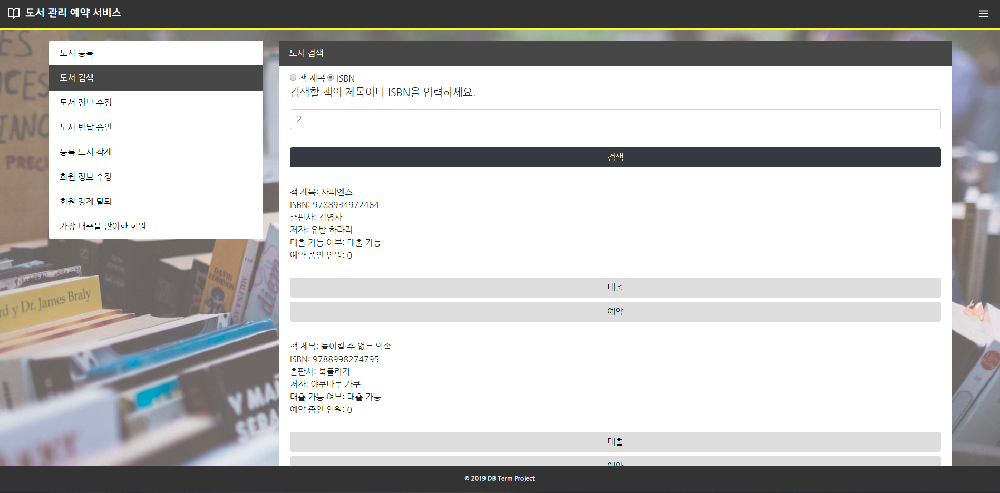
<br>

- 책 이름으로 도서 검색
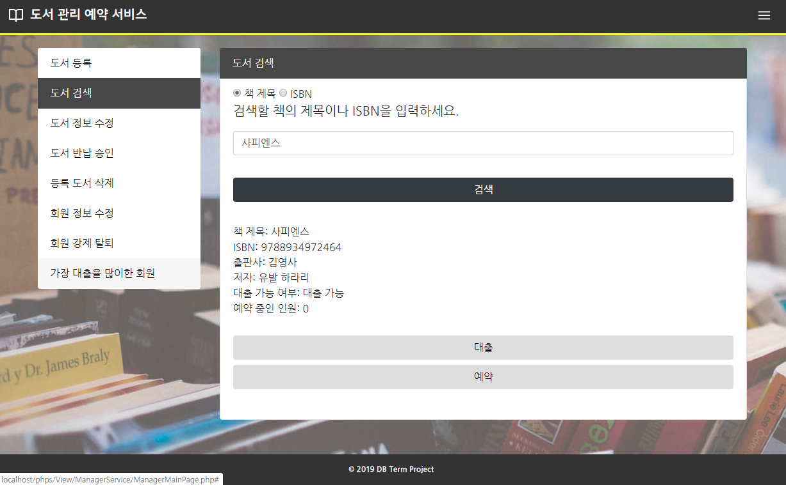
<br>

- 반납 승인
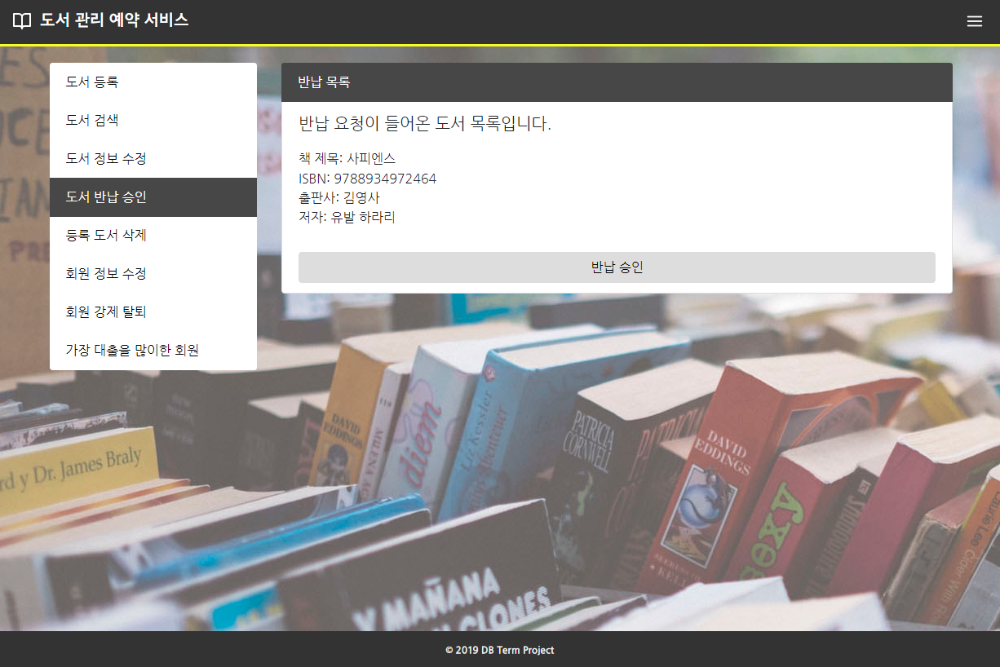
<br>

- 도서 정보 수정
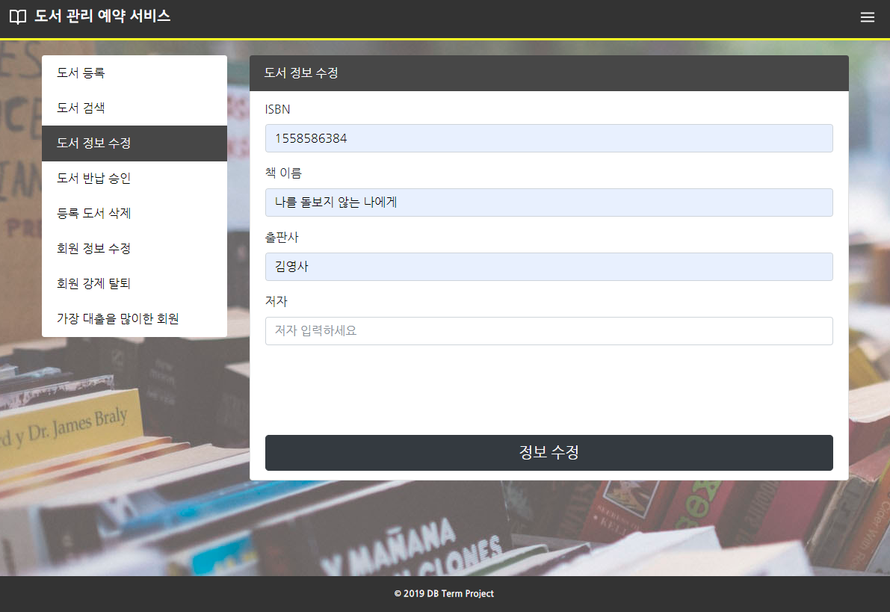
<br>

- 도서 제거
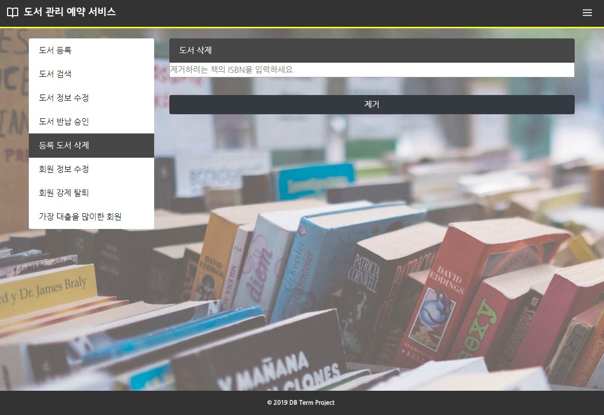
<br>

- 가장 대출을 많이한 유저 검색
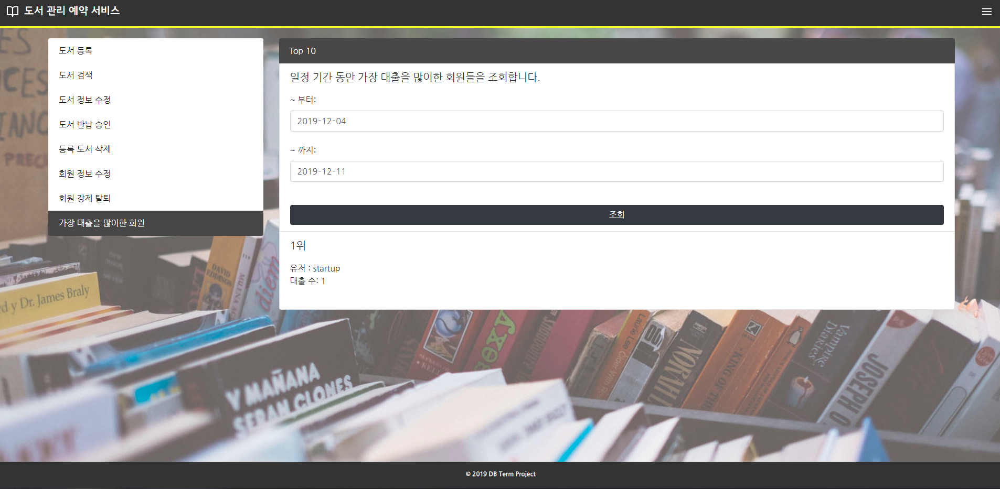
<br>

- 유저 정보 변경

<br>

